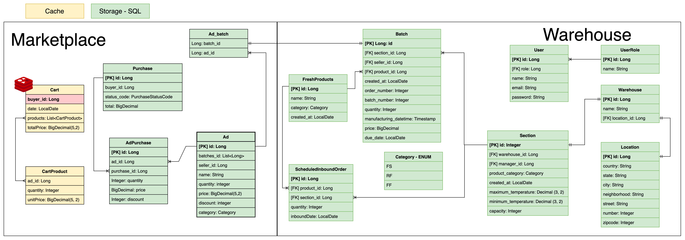

# Requisito 6

## USER STORY

> **COMO** REPRESENTANTE DO ARMAZÉM **QUERO** PODER RECEBER UMA INBOUND ORDER PROGRAMADA **PARA** PLANEJAR A DISTRIBUIÇÃO DOS LOTES NO MEU ARMAZÉM

## CENÁRIO
> **CENÁRIO 1**: RECEBO UM PEDIDO DE INBOUND ORDER PARA OUTRO DIA  
> **DADO** QUE A SEÇÃO ACEITA O PRODUTO  
> **QUANDO** O INBOUND ORDER PROGRAMADO É REQUISITADO  
> **ENTÃO** AS VALIDAÇÕES SÃO FEITAS  
> **E** ELE É ATRIBUÍDO A UM REGISTRO NO BANCO   

## VALIDAÇÃO

- Autentique como representante do armazém e acesse os terminais.
- Validação de parâmetros obrigatórios.
- Valida se o produto corresponde a seção alocada


## SETUP INICIAL DO WAREHOUSE
Na raíz do projeto execute o seguinte comando.
```shell
./Doc/requisitos/setup.sh
```

## ENDPOINTS AUXILIARES CRIADOS

Para os endpoints auxiliares, utilzados para a criação os registros iniciais, consulte a documentação do [requisito 01](Requisito%2001.md).

## Diagrama de classes



## ENDPOINTS DO CONTRATO CRIADOS

### <span style="color:blue">(POST)</span> /api/v1/warehouse/scheduled-inbound-order
> Cadastra uma ScheduledInboundOrder

__Obs.: Payload exemplo disponível na rota no Swagger (link no README do projeto)__

### <span style="color:yellow">(PUT)</span> /api/v1/warehouse/scheduled-inbound-order/{id}
> Atualiza uma ScheduledInboundOrder

### <span style="color:green">(GET)</span> /api/v1/warehouse/scheduled-inbound-order
> Lista todas as ScheduledInboundOrders cadastradas 

### <span style="color:green">(GET)</span> /api/v1/warehouse/scheduled-inbound-order/{id}
> Procura uma ScheduledInboundOrder específica

### <span style="color:red">(DELETE)</span> /api/v1/warehouse/scheduled-inbound-order/{id}
> Deleta uma ScheduledInboundOrder específica


